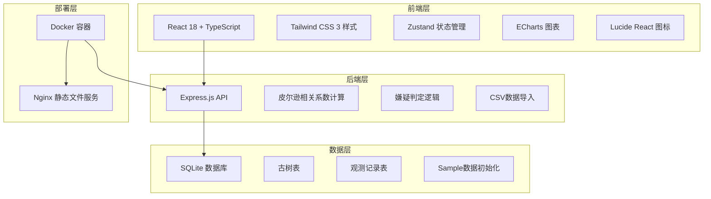
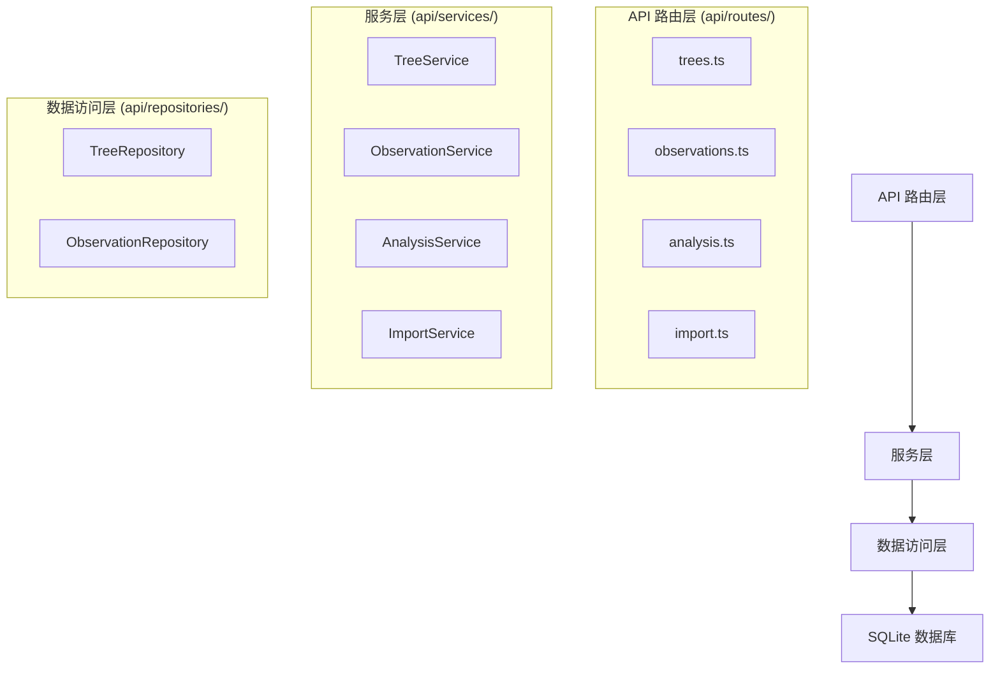
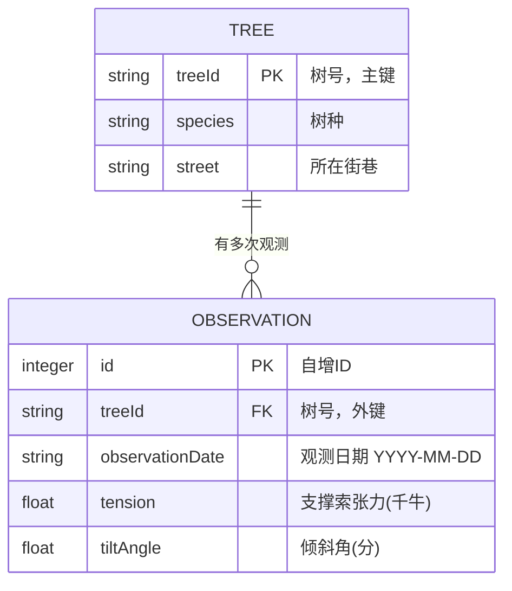

## 1. 架构设计



## 2. 技术说明

- **前端**：React@18 + TypeScript + Vite@5 + Tailwind CSS@3 + Zustand@4 + ECharts@5
- **后端**：Express@4 + TypeScript + better-sqlite3
- **数据库**：SQLite（嵌入式，无需额外容器，适合一键部署）
- **图表**：ECharts（功能强大，散点图和趋势线支持完善）
- **部署**：Docker 多阶段构建，Nginx 托管前端静态文件，Node 运行后端 API

## 3. 路由定义

| 路由 | 用途 |
|-------|---------|
| / | 分析主页 |
| /api/trees | 获取古树列表（支持街巷筛选） |
| /api/observations | 获取观测记录（支持日期范围、树号筛选） |
| /api/analysis | 计算皮尔逊相关系数和嫌疑判定结果 |
| /api/streets | 获取所有街巷列表 |
| /api/import | 批量导入观测数据（CSV格式） |
| /api/sample/reset | 重置为Sample数据 |

## 4. API 定义

```typescript
// 古树信息
interface Tree {
  treeId: string;
  species: string;
  street: string;
}

// 观测记录
interface Observation {
  id: number;
  treeId: string;
  observationDate: string;
  tension: number;
  tiltAngle: number;
}

// 分析结果
interface TreeAnalysis {
  treeId: string;
  species: string;
  street: string;
  correlationCoefficient: number;
  observationCount: number;
  firstTiltAngle: number;
  lastTiltAngle: number;
  tiltAngleIncrease: number;
  isSuspected: boolean;
  observations: { tension: number; tiltAngle: number }[];
}

// 分析请求
interface AnalysisRequest {
  streets?: string[];
  startDate?: string;
  endDate?: string;
}

// 分析响应
interface AnalysisResponse {
  trees: TreeAnalysis[];
  suspectedTrees: TreeAnalysis[];
  statistics: {
    totalTrees: number;
    totalObservations: number;
    suspectedCount: number;
    avgCorrelation: number;
  };
}

// 导入请求
interface ImportRequest {
  observations: Omit<Observation, 'id'>[];
}

// 导入响应
interface ImportResponse {
  success: boolean;
  importedCount: number;
  errors: string[];
}
```

## 5. 服务端架构



## 6. 数据模型

### 6.1 数据模型定义



### 6.2 数据定义语言

```sql
-- 古树表
CREATE TABLE IF NOT EXISTS trees (
  treeId TEXT PRIMARY KEY,
  species TEXT NOT NULL,
  street TEXT NOT NULL
);

-- 观测记录表
CREATE TABLE IF NOT EXISTS observations (
  id INTEGER PRIMARY KEY AUTOINCREMENT,
  treeId TEXT NOT NULL,
  observationDate TEXT NOT NULL,
  tension REAL NOT NULL,
  tiltAngle REAL NOT NULL,
  FOREIGN KEY (treeId) REFERENCES trees(treeId)
);

-- 索引
CREATE INDEX IF NOT EXISTS idx_observations_treeId ON observations(treeId);
CREATE INDEX IF NOT EXISTS idx_observations_date ON observations(observationDate);
CREATE INDEX IF NOT EXISTS idx_trees_street ON trees(street);

-- Sample 古树数据
INSERT OR IGNORE INTO trees (treeId, species, street) VALUES
('G001', '古银杏', '中山路'),
('G002', '古樟树', '中山路'),
('G003', '古槐树', '人民路'),
('G004', '古柏树', '人民路'),
('G005', '古榕树', '解放路'),
('G006', '古松树', '解放路'),
('G007', '古榆树', '长江路'),
('G008', '古柳树', '长江路');
```

## 7. 核心算法

### 7.1 皮尔逊相关系数计算

```
r = Σ[(xi - x̄)(yi - ȳ)] / √[Σ(xi - x̄)² * Σ(yi - ȳ)²]

其中:
- xi 为各观测点的张力值
- yi 为各观测点的倾斜角值
- x̄ 为张力平均值
- ȳ 为倾斜角平均值
```

### 7.2 索力失效嫌疑判定条件

```
isSuspected = (r < -0.6) AND (lastTilt - firstTilt > 1.2)

其中:
- r 为皮尔逊相关系数
- lastTilt 为日期范围内末次观测倾斜角
- firstTilt 为日期范围内首次观测倾斜角
```

## 8. 项目结构

```
.
├── src/                          # 前端源码
│   ├── components/               # 组件
│   │   ├── FilterPanel.tsx       # 筛选面板
│   │   ├── StatsCards.tsx        # 统计卡片
│   │   ├── CorrelationTable.tsx  # 相关系数表
│   │   ├── SuspectList.tsx       # 嫌疑清单
│   │   ├── ScatterChart.tsx      # 散点图
│   │   └── ImportPanel.tsx       # 导入面板
│   ├── pages/
│   │   └── AnalysisPage.tsx      # 分析主页
│   ├── store/
│   │   └── useAnalysisStore.ts   # Zustand状态管理
│   ├── utils/
│   │   └── api.ts                # API请求封装
│   ├── App.tsx
│   ├── main.tsx
│   └── index.css
├── api/                          # 后端源码
│   ├── index.ts                  # Express入口
│   ├── routes/                   # 路由
│   ├── services/                 # 业务逻辑
│   ├── repositories/             # 数据访问
│   ├── db.ts                     # 数据库连接
│   └── sampleData.ts             # Sample数据
├── shared/                       # 共享类型
│   └── types.ts
├── migrations/                   # 数据库迁移
├── Dockerfile                    # Docker配置
├── docker-compose.yml            # Docker Compose配置
├── vite.config.ts
├── tailwind.config.js
├── tsconfig.json
└── package.json
```
