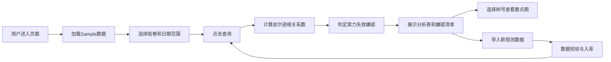

## 1. 产品概述

古树支撑索张力与树身倾斜角关联分析系统，为市政园林科提供古树健康监测的数据分析工具。通过对古树支撑索张力与树身倾斜角的长期观测数据进行皮尔逊相关系数分析，自动识别索力失效嫌疑的古树，辅助园林管理人员及时发现问题并采取保护措施。

- 核心价值：将传统人工巡检数据转化为可量化的健康风险评估指标，提高古树保护的科学性和及时性
- 目标用户：市政园林科管理人员、古树保护工作人员

## 2. 核心特征

### 2.1 功能模块

1. **数据筛选区**：街巷筛选、日期范围选择
2. **相关系数分析表**：按相关系数排序展示各古树的分析结果
3. **索力失效嫌疑清单**：自动标识符合风险条件的古树
4. **散点图可视化**：按树号切换查看张力-倾斜角分布关系
5. **数据导入功能**：支持追加导入新的观测数据
6. **Sample数据**：内置示例数据便于演示和测试

### 2.2 页面详情

| 页面名称 | 模块名称 | 功能描述 |
|-----------|-------------|---------------------|
| 分析主页 | 筛选控制区 | 街巷下拉多选、日期范围选择器、查询按钮 |
| 分析主页 | 相关系数排序表 | 树号、树种、街巷、相关系数、观测次数、首次倾斜角、末次倾斜角、倾斜角增量，按相关系数升序排列 |
| 分析主页 | 索力失效嫌疑清单 | 高亮展示满足条件（相关系数 < -0.6 且 倾斜角增量 > 1.2分）的古树 |
| 分析主页 | 散点图区域 | 树号选择器、X轴为张力（千牛）、Y轴为倾斜角（分）、显示趋势线和相关系数 |
| 分析主页 | 数据导入区 | CSV文件上传、导入历史记录、字段校验提示 |

## 3. 核心流程

## 4. 用户界面设计

### 4.1 设计风格

- **主色调**：深森林绿 `#1B4332`（代表自然、专业、稳重）
- **辅助色**：暖橙色 `#E07B39`（用于高风险警示、按钮）、橄榄绿 `#52796F`（次级操作）
- **中性色**：以石板灰 `#F8FAFC` 为背景，深灰 `#1E293B` 为文字，保持专业清爽的阅读体验
- **字体**：展示字体使用 Noto Serif SC（人文气息），正文字体使用 Inter（清晰易读）
- **按钮风格**：圆角8px，悬停时轻微上浮 + 阴影加深
- **布局风格**：卡片式布局，清晰的区块分隔，充足的留白
- **图标风格**：lucide-react 线性图标，统一20px尺寸

### 4.2 页面设计概览

| 页面名称 | 模块名称 | UI 元素 |
|-----------|-------------|-------------|
| 分析主页 | 顶部标题区 | 大字号标题、副标题说明、园林科徽章图标 |
| 分析主页 | 筛选控制区 | 内联式筛选表单，街巷多选框、日期范围选择器并排 |
| 分析主页 | 数据概览卡 | 4个统计卡片：古树总数、观测记录数、嫌疑树数、平均相关系数 |
| 分析主页 | 相关系数表 | 斑马纹表格，相关系数列按值渐变着色（绿→红） |
| 分析主页 | 嫌疑清单 | 橙色边框警示卡片，带警告图标和风险说明 |
| 分析主页 | 散点图区 | 带渐变背景的图表容器，下拉选择器，动态趋势线 |
| 分析主页 | 数据导入区 | 拖拽上传区域，CSV格式说明，导入按钮 |

### 4.3 响应式设计

- **桌面优先**：1280px以上为标准布局，筛选控件横向排列，表格与图表左右分栏
- **平板适配**：768px-1280px，筛选控件换行，图表与表格改为纵向堆叠
- **移动适配**：768px以下，筛选控件全宽堆叠，表格支持横向滚动，图表自适应宽度

### 4.4 交互与动效

- 页面加载：卡片从下往上渐入， staggered 延迟100ms
- 悬停效果：表格行高亮、卡片轻微上浮（translateY(-2px)）、阴影加深
- 数据更新：图表数据切换时平滑过渡动画（300ms ease-out）
- 风险标识：嫌疑清单条目带轻微脉冲动画，吸引注意
